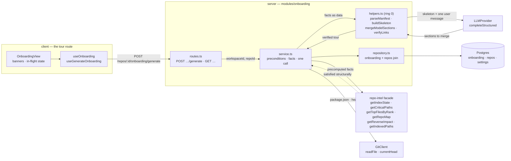
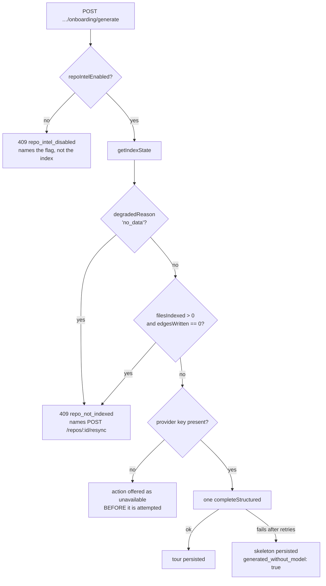

# Onboarding Generator — why the tour is a blocking POST over a pure kernel

The Onboarding Generator produces one per-repository tour of five fixed sections —
`overview`, `architecture`, `key_modules`, `getting_started`, `conventions` — from facts the
indexer already computed plus **one** structured model call. It adds
`server/src/modules/onboarding/` and the client route
`client/src/app/repos/[repoId]/onboarding/`. This page records the decisions behind it; the
acceptance criteria live in [../../specs/02-onboarding-generator.md](../../specs/02-onboarding-generator.md)
and what the two endpoints expose belongs in [../README.md](../README.md).

## The shape of a generation

Six ports, one model call, one write. The `GET` traverses the same slice with the model edge
removed — reading a tour costs nothing and makes no call
(`server/src/modules/onboarding/service.ts:118-129`).

## Why generation is a blocking POST and not a job (O1)

The transport was the hardest of the two forks in
`.devdigest/cache/options/onboarding-generator.md`, and it was settled by the shared
`JobRunner`'s own defaults rather than by preference. The runner is one instance constructed
with `timeoutMs ?? 120_000` and `retries ?? 2` (`server/src/platform/jobs.ts:41-42`), and
`withRetry` re-runs the **whole handler** on failure (`:64-80`). A structured onboarding call
needs the conventions-style budget — `ONBOARDING_TIMEOUT_MS = 300_000`
(`server/src/modules/onboarding/constants.ts:36`), copied from the conventions extractor's
measured number. So a job-backed generation would time out at 120 s and retry, making up to
**three model calls for one request**, which is a direct violation of the spec's "exactly one
structured model call" (AC-02).

Widening that timeout is not a local change: the same runner carries clone, index, refresh,
resync and polling. Paying a platform change shared by five job kinds to buy durability for
one feature was judged the wrong trade.

> **The cost is real and was accepted, not designed around.** A reload during a 30–170 s
> generation abandons it silently — the money is spent, no row is written, and the in-flight
> state is component-local so it does not survive navigation. The spec carries this as Open
> question 1, still open.

The rejected alternatives: **O2**, a job row plus polling, needed the platform change above
*and* an amendment to the spec's own Non-goals. **O3**, a `{ status: 'generating' }` lease
inside the existing jsonb row, kept one call and explained the loss instead of resuming it,
but it turns a single write into two — and the spec's Edge cases require a two-write design to
state its partial-failure behavior first. One document in one row owes no such statement.

## Why the derivation is a pure ring-0 kernel (O4)

`helpers.ts` owns manifest parsing (`:35`), the five-section skeleton (`:166`), the merge
(`:229`) and link verification (`:279`) as pure functions over plain data. The service does
I/O and the one model call, nothing else.

The consequence that matters is ordering: the skeleton is built **before** the model is
consulted (`service.ts:139`), so the fact-only tour is the base case the model *enriches*
rather than a catch branch. A failed call therefore costs prose and never structure, which is
why the fallback path (AC-11) needs no separate code. The merge is one-directional — a model
section may contribute `body`, `diagram` and `links` to a `kind` that already exists and can
add nothing else.

The second consequence is testability: the two things most likely to be wrong — the skeleton
and link verification — are provable with no database and no adapters. The indexed set arrives
as a `Set<string>`, never as a row type, because `c5-pure-helpers` counts even a type-only
import of `db/` as an edge.

The rejected pole, **O5**, put the same logic in the service and promoted `CollapsibleSection`,
`CodeBlock` and `PageToc` into `@devdigest/ui`. Both a copy button and a collapse control need
client state, and `client/src/vendor/ui/` has **zero** `"use client"` files today; a barrel
export is also a contract that is expensive to undo. The price paid instead is a fourth private
collapsible-section implementation, under
`client/src/app/repos/[repoId]/onboarding/_components/`.

## Why degradation is distinguished rather than collapsed

Four situations could each be reported as "something went wrong". They are four different user
problems with four different remedies, so the service keeps them apart
(`server/src/modules/onboarding/service.ts:215-266`).

A missing key is answered on the **read** path, not the write one: `read` returns an
availability block (`{ can_generate, reason, provider }`) so the view can present the control
as unavailable rather than let the operator spend the attempt. Only key *presence* is ever
tested; no secret value reaches a response.

### Why the check reads the edge counter, not `repo_index_state.status`

`status` means "nothing threw", not "the data is there" — `server/insights.md:14` records a
real run stamped `status: 'full'` with 548 files indexed and an empty `file_edges`. The
precondition therefore branches on the counter the pipeline actually wrote
(`service.ts:241`), and `ports.ts:98-101` says in the port's own comment that `status` is on
the interface only because the facade returns it, and that nothing here branches on it.

The paired criterion is the one that is easy to get wrong in the other direction: **zero
indexed files stays healthy.** `SUPPORTED_EXT` is JS/TS only
(`server/src/modules/repo-intel/constants.ts:14`), so a Python or Go repository indexes to
zero files and is not a broken index. Only zero *edges over a non-empty file count* is.

The same reasoning produced `flag_off` as a constructor value rather than a port reading:
`degradedReason === 'flag_off'` is declared at `server/src/modules/repo-intel/types.ts:27`
and produced nowhere in `server/src`, so a disabled layer is otherwise indistinguishable from
an unindexed repository. The flag is passed in as a plain configuration value
(`service.ts:96-104`).

## Hotness is still 0, and the tour says so

The reading path is pure PageRank. This is not a shortcut taken here — it upholds the
repository's pre-existing recorded Option B decision at
`server/src/modules/repo-intel/pipeline/rank.ts:4-7`: the clone is shallow at
`CLONE_DEPTH = 1`, so there is no churn window, and rather than deepen the clone hotness was
dropped from v1 with the column left at 0 so it can be switched on later without a migration.

`CLONE_DEPTH` and `pipeline/rank.ts` were deliberately not touched. The tour persists
`hotness_available: false` (`service.ts:191`) and the view renders a note stating that the
order reflects import rank alone and does not account for change frequency — the limitation is
surfaced rather than hidden.

`server/src/modules/repo-intel/README.md` described `rank.ts` as "PageRank + git hotness →
file rank" and had done since the Option B decision; that line was corrected to match the code
as part of this change.

## The new fields live inside the existing jsonb, and all four are `.nullish()`

No migration was needed: `onboarding` is `repo_id` PK + `json` + `generated_at`, and the four
fields this feature added — `sha`, `dropped_links`, `generated_without_model`,
`hotness_available` — all live inside that document
(`server/src/vendor/shared/contracts/knowledge.ts:44-60`, and the byte-identical client copy).

Every one is `.nullish()` rather than `.nullable()`. A field parsed back out of jsonb must
tolerate an **absent key**, and `.nullable()` still requires the key to be present — so
`.nullable()` would stop every previously written document parsing on the day the field
landed. `insights.md:81` is the scar that produced the rule, and `OnboardingSection.diagram`
is the in-file precedent.

`sha` is what makes a stale tour safe rather than merely labelled: every file link is a blob
URL at the sha the tour was generated at, so a file that has since moved still resolves to the
commit the tour described. The view compares that sha to the repository's current head and
shows a regenerate banner when they differ; it never rewrites the links to head.

## Model output is verified, not trusted

The model's cited paths are checked by exact membership against the indexed file set —
`getIndexedPaths`, one narrow read added to the repo-intel facade
(`server/src/modules/repo-intel/types.ts:227`, implemented at `repository.ts:179`) — and every
path outside it is dropped, with the count persisted and reported. The count exists so the
loss is observable: `SUPPORTED_EXT` is JS/TS only, so a cited `README.md` **will** drop, and
the honest response to that is a visible number rather than a quietly widened set.

The model's `title` is ignored for display — the client renders section titles from its own
`onboarding` namespace keyed by `kind`, so an unrecognised or model-renamed section cannot
change the page. A `kind` outside the five is not rendered at all
(`client/src/app/repos/[repoId]/onboarding/_components/OnboardingView/helpers.ts:13-22`),
which matters because `OnboardingSection.kind` is `z.string()` on the wire and the client
performs no runtime validation: `@devdigest/shared` is types-only there, and a runtime import
breaks the Next build.

Everything read out of the repository reaches the model inside one untrusted block
(`helpers.ts:192-207`), and section bodies render through the existing `Markdown` primitive —
`react-markdown` + `remark-gfm` with no `rehype-raw` — so no sanitiser and no new dependency
was required. The prompt's stale sixth section, `routes_and_apis`, was removed from
`server/src/prompts/onboarding.system.md` in both places it appeared; left alone it told the
model to emit a diagram on a section the view refuses to render.

## Tenancy is a join, and it is re-resolved on the write path

The `onboarding` table carries no `workspace_id`, unlike every other domain table — its only
key is `repo_id`. Isolation is therefore a join through `repos.workspace_id`, on the read
(`server/src/modules/onboarding/repository.ts:66-73`) and on the write
(`:86-100`), where `upsert` re-resolves the owning repo itself rather than trusting the caller
to have done it.

The security review raised this as an **A06 design advisory**, and it is worth restating
plainly: the isolation is correct today, but it is a property of the call sites rather than of
the row. Nothing in the schema stops a future method from addressing a tour by `repo_id`
alone. A repository method that scopes its read but not its write is one refactor away from
being wrong, which is why the redundant check in `upsert` was kept rather than optimised out.

## Two module boundaries the slice pays for on purpose

- **The per-feature model choice is re-resolved locally.** `no-cross-module` forbids importing
  `modules/settings/feature-models.ts`, so `resolveModel` reads the `settings` **table**
  through this module's own repository and validates it with the shared `FeatureModelChoice`
  schema, falling back to the registry default (`service.ts:337-354`). The conventions service
  carries the same duplication for the same reason, and both say so in a comment.
- **Every repo-intel shape is restated, never imported.** `ports.ts:103-132` describes the six
  methods this module needs; the facade satisfies the interface structurally with no
  `implements`, and the container passes it straight in. A type-only import of the sibling
  slice's `types.ts` would still be an edge to dependency-cruiser.

`getIndexedPaths` was added to the repo-intel facade rather than read here because
`RepoIntelRepository` is the only layer that may touch `symbols` — one repository per table.

## What was measured

`corepack pnpm arch` clean: 201 modules, 664 dependencies, the known-violations baseline
unchanged at 27. Server unit 343 passed / 1 skipped, server integration 125 passed with Docker
up, client 265 passed across 36 files. The architecture pass returned 0 findings; the security
pass returned 0 exploitable findings with 11 candidates refuted; traceability scored 81 of 83
items met with 0 missing, and SPEC-02 moved `approved → implemented` on that condition.

Three declared deviations from the plan, all verified as corrections rather than drift: the
service takes six dependencies rather than four (the key-presence read and the flag), the i18n
titles live under `sectionTitles.*` because the namespace already binds `sections` to a string
that may not be removed, and the view has one generate control rather than two because two
identically-named controls made the in-flight and empty states unassertable by role and name.
