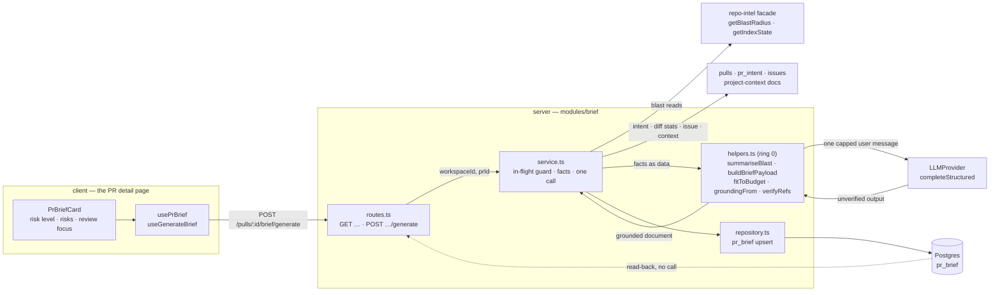

# PR Brief — why the card carries its own risk level, and why grounding is path-only

The PR Brief answers the two questions a reviewer opens a pull request to ask and the studio
did not answer: **what is risky about merging this**, and **which files should I read first**.
It adds `server/src/modules/brief/`, the system prompt
`server/src/prompts/brief.system.md`, the client hook `client/src/lib/hooks/brief.ts` and the
card `client/src/app/repos/[repoId]/pulls/[number]/_components/PrBriefCard/`. This page
records the decisions behind it; the 42 acceptance criteria live in
[../../specs/03-pr-brief-card.md](../../specs/03-pr-brief-card.md) and what the two endpoints
expose belongs in [../README.md](../README.md).

Two endpoints, and the asymmetry between them is the whole design:
`GET /pulls/:id/brief` reads a stored document and costs nothing;
`POST /pulls/:id/brief/generate` makes exactly one structured model call and persists one
document (`server/src/modules/brief/routes.ts:55-70`).

## The shape of a generation

Six inputs, one call, one write. The `GET` traverses the same slice with the model edge
removed: it reads the row, compares head sha and model, and returns — no call, no write, no
money (`server/src/modules/brief/service.ts:145-163`).

## Why the card shows a risk level and not a verdict (D1)

The design's headline read `Request changes · 6 findings · 2 blockers · PR SCORE 61`. Every
one of those figures comes from `agent_runs`, and taking them would have made the brief
**conditional on a review having happened** — a pull request nobody has run an agent over
could not have a brief at all. That is the opposite of what this feature is for: the brief is
what you read *before* you decide how carefully to review.

So the card renders the brief's own `risk_level`, produced by the same single call that
produced everything else on it, and renders no verdict, no findings count, no blocker count
and no score (`PrBriefCard.tsx:190`). The verdict surface already exists — `VerdictBanner` on
the Agent runs tab — and stays there.

## Why the risks are in the brief card and not in `IntentCard` (D2)

The design placed RISK AREAS inside the intent card. One model call's output split across two
cards means two loading states, two error states and two regenerate buttons for one purchase,
and `pr_intent` has no risk column to hang it on, so it would also have meant a second
endpoint. The risks render where they were produced. **`IntentCard` is not modified by this
feature** — the brief card is simply mounted above it in `OverviewTab`
(`OverviewTab.tsx:58-70`).

## Why a file reference is `{ path, line }` and not `path:line` (D3)

The pre-existing scaffolded contract had `Risk.file_refs: string[]`. A preformatted
`path:line` string cannot represent a reference with no line, and it forces every consumer to
re-parse a format nobody validates. The structured pair makes both halves independently
verifiable — the path is checked against the assembled input, the line is optional and its
absence is a legal state rather than a parse failure.

That pays off directly on the client: a focus entry with no line opens its file on the diff
tab with no line target instead of being inert, because `openFile` clears `?line` rather than
writing a made-up number (`client/src/app/repos/[repoId]/pulls/[number]/page.tsx:172-179`).

## Why grounding is path-only, and what that leaves ungrounded (D4)

AC-13 originally required dropping any entry naming "a file, symbol or endpoint" not present
in the assembled input. It was **narrowed after approval**, at the stage-7 gate, and the
narrowing is dated and justified inside the spec itself
([../../specs/03-pr-brief-card.md](../../specs/03-pr-brief-card.md), § *Grounding*).

The reason is that a symbol or an endpoint only ever appears inside freeform prose —
`risk.title`, `risk.explanation`, `focus.reason` — which carries no machine-readable field to
verify against and never becomes a link. Verifying it would have meant adding `symbols[]` and
`endpoints[]` to the model schema, i.e. a contract change, to check claims that were never
clickable. The structured `{ path, line }` reference is the whole of what becomes a deep link,
so that is exactly what `verifyRefs` checks, against the set built by `groundingFrom`
(`server/src/modules/brief/helpers.ts:261-266,285`).

> An ungrounded claim can still reach the reader inside prose. That is an accepted property of
> this feature, recorded in the spec's § *Untrusted inputs*, not an oversight — superseding it
> means a new spec, not an edit to AC-13.

Grounding runs against the **post-drop** fact set (`service.ts:246`), so a project-context
document dropped to fit the token budget cannot ground a reference to itself.

## Why the input is capped at 8 000 tokens, and what goes first (D5)

The cap is counted with the server tokenizer before the call is made
(`server/src/modules/brief/constants.ts:18`), and it is a *budget*, not a provider limit —
`TiktokenTokenizer` degrades permanently to `ceil(chars / 4)` when its BPE ranks fail to load,
so on that path the cap is enforced against an estimate. The spec says so; the constant's
docblock says so.

`DROP_ORDER` is the fixed sequence, and the array **is** the order — `fitToBudget` walks it and
the names it returns are the names stored in the document
(`constants.ts:28-33`, `helpers.ts:234`):

| # | Dropped | Why it can go |
|---|---|---|
| 1 | `project_context` | Repository prose; useful, never load-bearing for a risk judgement |
| 2 | `issue_body` | The issue's *title* survives; the body is the bulk |
| 3 | `file_list_tail` | The head of the changed-file list is kept (`FILE_LIST_HEAD_N = 25`) |
| 4 | `blast_downstream` | The blast headline survives; the caller detail is the bulk |

The derived intent and the diff stats are **absent from that array on purpose** and survive by
construction. Diff hunk bodies are never in the payload at all — `pr_files.patch` is not read.

Every drop is recorded by name in the stored document (`service.ts:224`), beside the sources
that were absent or degraded for reasons of their own, and the card names all of them to the
reader (`PrBriefCard.tsx:262`). Per-input character caps applied at assembly
(`MAX_DESCRIPTION_CHARS`, `MAX_ISSUE_CHARS`, `MAX_CONTEXT_DOC_CHARS`) are deliberately *not*
drops and are never reported as such: they bound one pathological input so the four ordered
drops operate on a sane payload.

## Why cost lives in the document and never in `agent_runs.cost_usd` (D6)

Following the precedent set deliberately at
`server/src/modules/reviews/run-executor.ts:394-401`, the brief's `tokens_in`, `tokens_out` and
`cost_usd` are written into the brief document's own `usage` block and returned in the
generation envelope (`service.ts:262-271`). For a brief the precedent is not merely a
convention to match — a brief has **no run**, so `agent_runs.cost_usd` is not the wrong place
for it, it is unreachable. An unpriced call renders as unpriced rather than as costing zero.

## Why `REPO_INTEL_ENABLED=false` stops being silent here (D7)

Everywhere else in this package that flag degrades behavior without saying so
(`../CLAUDE.md:69-72`). For this feature the disabled flag is recorded as the blast source's
reason and shown in the card. It is read **off the config rather than recovered from the
facade** (`routes.ts:50-52`, `service.ts:350-358`), because the facade short-circuits on the
flag before it reaches the point where it would stamp `flag_off` — a disabled flag and an
unindexed repository are otherwise indistinguishable to a caller.

## Why the brief slice cannot import the blast service

`no-cross-module` blocks reaching a sibling module's helper or bare constant, **including
type-only imports**. So `modules/brief/` does not call `modules/blast/service.ts` for its
blast-radius summary. It declares its own narrow port over exactly two of the repo-intel
facade's eleven methods — `getBlastRadius` and `getIndexState`
(`server/src/modules/brief/ports.ts:120-123`) — and renders the paragraph in its own pure
helper, `summariseBlast` (`helpers.ts:89`). Moving the summary into the facade would have meant
editing a slice this feature has no business editing.

The same rule is why `SECRET_KEY_BY_PROVIDER` and `BRIEF_FEATURE_MODEL_ID` are restated in
`constants.ts:71-96` rather than imported from `modules/settings`. `risk_brief` is
**deliberately shared** with blast history-notes: both features resolve
`feature_models.risk_brief`, so changing one changes the other. Un-sharing it would mean a new
registry id in both `contracts/platform.ts` copies plus a settings-UI change, and no criterion
needs it.

## Storage, reuse and the two duplicated columns

A brief is reusable only when its recorded head sha **and** its recorded model both match —
the same rule `pr_intent` already states (`service.ts:150`). Staleness is computed server-side
and returned as a field, so the client compares nothing.

`pr_brief` gained `head_sha`, `model` and `generated_at` in
`server/src/db/migrations/0016_eager_wendell_rand.sql`. The first two duplicate values that are
*also* written inside `json` (`server/src/db/schema/reviews.ts:88-109`), and that is
deliberate: the document has to be self-describing once it leaves the database, while the
staleness comparison must be a column read that never deserialises a document to answer.
Migrations do not run on boot, so this is a deployment step.

The head sha is captured **before** the call (`service.ts:210`). If the pull request's head
advances while the model is thinking, the stored brief is attributed to the head it actually
described, and immediately reads as stale against the new one.

One write of one document (`service.ts:272-280`), so there is no partial-brief state to
observe and any throw anywhere above it leaves the previously stored brief untouched.

## Why a brief per commit was deferred

A "why timeline" — one brief per commit, so a reviewer could watch the risk judgement move —
was raised and explicitly deferred. `pr_brief.pr_id` is a **primary key** and regeneration
replaces. Reversing that is a schema change plus a history surface, and neither is in scope
here; the decision is recorded so a later reader knows it was a choice.

## Concurrency and the paid-route posture

The in-flight guard is a check-and-add with **no `await` between the two**
(`service.ts:167-179`), because testing it after an awaited lookup — as the intent service once
did — let two concurrent callers both pass the test and both pay. A second caller gets a 409
`brief_in_flight` rather than a second call.

On the client, generation is a `useMutation` and never a `useQuery`
(`client/src/lib/hooks/brief.ts:83-93`): a query refires on window refocus and on remount, and
this one costs money. The `POST` also carries the house rate limit for paid routes, 10/min,
because the global 120/min would otherwise allow 120 billed generations a minute
(`routes.ts:62-65`).

Missing provider key answers **503** with `AppError('missing_model_key', …)`, not the 500 that
`ConfigError` would produce (`service.ts:194-207`). The app is advertised as booting with zero
API keys, so a paid route has to say a key is required rather than look broken.
