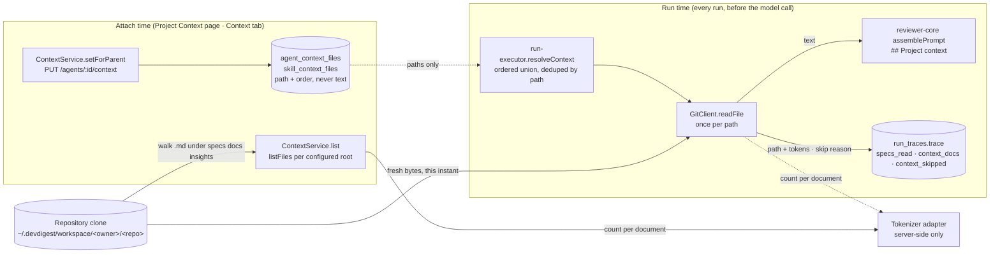

# Project context

Why attaching a repository's own markdown to an agent stores **paths and not text**, why the
injected block has **no size cap**, why a skipped document is **named** in the trace, and why
the type badge is **data rather than translated copy**.

The feature itself: a user attaches markdown documents from a repository's clone to an agent
or to a skill; before every run the server reads those documents fresh out of the clone and
injects their text into the prompt's `## Project context` section as untrusted,
delimiter-wrapped data; the run trace names which documents were read, each one's token size,
and the reason any was skipped.

Requirement: [`../../specs/01-project-context-documents.md`](../../specs/01-project-context-documents.md)
(SPEC-01). Prompt conventions and how the `## Project context` section sits among the other
prompt blocks: [`../../docs/agent-prompts/README.md`](../../docs/agent-prompts/README.md) —
that stays the single home for them.

## The seam was already there

**This feature was half-built and dormant before any of the work described here.** That is the
single fact a reader will not guess from the diff, and it explains most of what follows.

`git log -S "Project context" -- reviewer-core/src/prompt.ts` returns exactly one commit — the
initial squashed snapshot. Before this change, in that snapshot:

- `prompt.ts` already rendered the section (`reviewer-core/src/prompt.ts:150`) from
  `PromptParts.specs`, already wrapping each document in its own untrusted block with a
  `spec-<i>` label (`:114-116`);
- `ReviewInput.specs` was already threaded through the engine;
- `PromptAssembly.specs` and `RunTrace.specs_read` already existed in **both** `vendor/shared`
  copies;
- the trace drawer already rendered both rows
  (`client/.../RunTraceDrawer/_components/TraceBody/TraceBody.tsx:39`, `:92`).

Nothing populated any of it. `run-executor.ts` never passed `specs` and hardcoded
`specs_read: []`. So the work was **filling a seam, not cutting one**, and the run path now
supplies exactly what the engine had always been able to render
(`server/src/modules/reviews/run-executor.ts:316`).

That is also why the spec could demand a byte-identical prompt for the empty set (AC-23) and
why nothing in `reviewer-core` changed except the injection guard's enumeration of untrusted
sources (`reviewer-core/src/prompt.ts:19`, pinned by `reviewer-core/test/prompt.test.ts:26`).

## Attach time versus run time

The two halves of the feature touch the clone for different reasons at different moments. What
is *stored* is a path list; what is *read* is whatever the clone holds at run time.

Two consequences of that shape are worth stating out loud. A resync between saving an
attachment and running changes the injected bytes — by design; the trace is what makes the
change visible. And every token figure in the UI comes from the tokenizer *adapter*
(`ContextService.list` at `server/src/modules/context/service.ts:56-76`), never from the
client, because that counter degrades permanently to a characters-based estimate when its
encoder fails to load — the numbers are approximations and are labelled as such.

## Paths, never text

**An attachment is `(agent|skill, repo, path)` plus an order, and nothing else.** The two
tables carry no document body, no size and no snapshot
(`server/src/db/schema/agents.ts:86`, `server/src/db/schema/skills.ts:55`; migration
`0015_boring_shadow_king.sql`).

The reason is freshness: a run must review against what the repository says **now**, not
against what it said when someone ticked a checkbox. Storing text would have created a second
source of truth that silently disagrees with the clone, and the studio has no way to reconcile
one — the clone is depth-1 and gets resynced.

The composite primary key is the identity the spec states, expressed where the database can
enforce it rather than in application code, and the `(repo_id, path)` index on
`agent_context_files` is the access path for "how many agents attach this document" — a
`COUNT … GROUP BY path`, the shape `Skill.used_by` already had over `agent_skills`.

Position in the request array **is** the injection order, so attaching and reordering are the
same call: the whole ordered set arrives in one `PUT` and the repository swaps it in one
transaction (`server/src/modules/context/repository.ts:88-93`). Last write wins, and the
response is what was persisted, so a client that lost a race sees the truth on its next
refetch.

## No size cap on injection — deliberately

**The per-file limit bounds discovery and attachment only. It governs nothing in the run
path.** A document over `MAX_CONTEXT_FILE_SIZE` is still *listed*, marked not-attachable with
a server-supplied reason (`server/src/modules/context/constants.ts:16-24`), and refused on the
write side (`service.ts:213-243`). A document that was attached **before** it grew past the
ceiling is still injected in full, verbatim, untruncated.

The alternative — a run-time cap — was rejected because truncating a document silently
produces a review judged against half an invariant, which is worse than a run that fails
loudly.

> A user can therefore attach a document set large enough that **every** run of that agent
> fails at the model provider with a context-window rejection. That is the specified behavior,
> not a bug. What makes it diagnosable is that the failure path persists the same three trace
> fields as the success path (`run-executor.ts:750-757`), so the failed run still names the
> documents it had read and how many tokens they were.

Note that the threshold itself never reaches the client. The server sends a verdict
(`attachable` plus an enum reason), not a number to compare against — putting the byte ceiling
into a response would have duplicated it into both `vendor/shared` copies and into the UI copy
as well.

## A skipped document is named

**A document that is missing, unreadable, or resolves outside the clone is skipped from the
injected block, and recorded with its reason.** The run continues — the documents are
enrichment, and one deleted file must not cost the review — but nothing is dropped silently
(`run-executor.ts:679-715`; the reason is classified from the adapter's own message by
`skipReason` at `:769`).

This is deliberately the opposite of the adjacent precedent. With `REPO_INTEL_ENABLED=false`,
or against an unindexed repo, the repo-skeleton and callers sections degrade **invisibly** —
the prompt simply has less in it. Here the user picked these documents by hand, so an absent
one is a fact about their configuration and not a system state they can be expected to infer
from a weaker review.

The reasons reach a human through the run log, which the trace persists:
`context: N read, M skipped` followed by one line per skipped path
(`run-executor.ts:712-713`). No document *text* is ever logged — paths, counts and token
sizes only.

## The type badge is data, not copy

**A document's displayed type is the matched search root's own directory name, verbatim.** A
document under `adr/` badges `adr`; one under `specs/` badges `specs`
(`server/src/modules/context/helpers.ts:85-102`, `rootFor` at `:17-22`).

The first implementation mapped the matched root onto a closed `ContextDocType` enum. It was
removed for two reasons: the enum collapsed every non-default root onto a single fallback
value, so `adr/` and `rfc/` were indistinguishable; and it was a deviation from the supplied
design, whose badges read in the plural — the directory names themselves. `ContextDocType` is
now `z.string()` (`server/src/vendor/shared/contracts/platform.ts:286`).

The consequence a future editor needs, and the one they are most likely to "fix": **the badge
is not routed through next-intl.** It is repository-derived data rendered as it arrives
(`client/src/components/ContextAttachList/ContextAttachList.tsx:161-165`,
`client/src/app/repos/[repoId]/context/_components/ContextView/ContextView.tsx:196`) — the
same rule the empty state's interpolated root list already follows. Sentences around it stay
translated.

This widening trips no closed-vocabulary rule: the one in the root `CLAUDE.md` covers
`Severity` and `Verdict`, and reaches no further.

## Why `ContextSearchRoot` carries `dir` alone

`SpecFile` carries `doc_type` (`contracts/platform.ts:322`) while `ContextSearchRoot` carries
only `dir` (`:340-352`). **That asymmetry is intentional and is not an inconsistency.**

- For a **root**, the type *is* the root's own name. A second field would ship the same string
  twice in one object, and a contract that does invites drift — this file is duplicated into
  `client/src/vendor/shared/`, so the day one copy is updated and the other is not would pass
  quietly in two places at once.
- For a **document**, the type is not derivable on the client at all. Given
  `specs/api/public.md`, the client knows neither which configured root matched nor how many
  path segments that root spanned.

The roots are exposed as their own read (`GET /repos/:id/context/roots`,
`server/src/modules/context/routes.ts:60-67`) rather than as a field on the listing, because
the one surface that must name the searched directories is the empty state — and it has no
document to hang them off.

## `listFiles` went on `GitClient`, not on a new port

**The recursive `.md` walk was added to the existing `GitClient` port rather than given a
`CloneReader` port of its own** (`server/src/vendor/shared/adapters.ts:227-240`, implemented
at `server/src/adapters/git/simple-git.ts:167-233`).

The reason is that the clone-containment guard — `realpath` **both** sides and compare, because
a lexical check cannot see a symlink into an attacker-controlled clone — is the
security-critical code in this adapter, and it must not exist twice. `readFile` already carries
it (`simple-git.ts:142-147`) with a docblock spelling out the attack it prevents: a
`docs/plan.md` symlink to the operator's `~/.devdigest/secrets.json`.

Both reviewers upheld the trade against the narrow-ports rule. The architecture reviewer noted
that the stronger argument is not code duplication at all: a separate `CloneReader` port would
have the same *role* as `GitClient` — read-only access to the same directory — and role, not
method count, is what the narrow-ports rule actually governs.

`listFiles` applies no size limit of its own; it reports `size` per entry and the caller owns
the ceiling. That is what keeps the discovery limit a `modules/context/` decision instead of an
adapter one, and it is why the constant is restated in that module rather than imported from
the indexer slice.

## `mustGetRepo` was split

**`getRepoOr404` answers "does this repo exist in this workspace"; `mustGetRepo` adds "and does
it have a clone".** (`server/src/modules/context/service.ts:154-172`.)

The split exists because `GET /repos/:id/context/roots` must answer for a repository with no
clone at all: **the roots are configuration, not clone state.** Every read that actually walks
or reads the clone goes through `mustGetRepo` and answers `409 repo_not_indexed` without one,
mirroring the nearest precedent in `modules/conventions`. The roots read goes through
`getRepoOr404` and answers 200.

A related fine distinction lives in `assertAttachable` (`service.ts:213-243`): a malformed path
— absolute, traversing, not markdown — is refused outright, but a path that is merely **not in
the discovered set** is allowed through. A document attached and then deleted from the
repository has to stay in the set long enough for its owner to detach it.

## What the trace carries, and what the drawer shows

The trace persists more than the drawer renders today, and the difference matters when
debugging:

| Field | Written at | Rendered in the drawer |
|---|---|---|
| `specs_read` — injected paths, in order | `run-executor.ts:428`, `:754` | yes — the *Specs read* row (`TraceBody.tsx:39`) |
| `prompt_assembly.specs` — the full injected block | engine output | yes — a prompt block (`TraceBody.tsx:92`) |
| `prompt_assembly.specs_tokens` | `run-executor.ts:414` | **no** — unlike `skills_tokens` at `TraceBody.tsx:83` |
| `context_docs` — per-document token sizes | `run-executor.ts:429`, `:756` | **no** |
| `context_skipped` — path plus reason | `run-executor.ts:430`, `:757` | **no**, but the same facts appear as run-log lines |

Every one of the three new fields is `.nullish()`, never `.nullable()`
(`server/src/vendor/shared/contracts/trace.ts:53`, `:121`, `:126`): the whole trace
round-trips through the `run_traces.trace` jsonb, so a trace written before a key existed
simply omits it, and `.nullable()` would still have required the key to be present.

## Configuration

`DEVDIGEST_CONTEXT_ROOTS` — comma-separated, clone-relative directory names, searched
recursively in the order given. Default `specs,docs,insights`
(`server/src/platform/config.ts:34`, `:73`). See the env table in
[`../README.md`](../README.md).

**Named roots rather than a glob, because the badge needs a name to show.** A glob such as
`**/{specs,docs}/**/*.md` matches the same files but supplies no label for the matched root, and
the displayed type is defined as that label.

Order is significant: a path reachable from two configured roots takes the **first** root, which
is what makes the badge deterministic when roots nest (`modules/context/helpers.ts:55-74`).

Discovery follows the indexer's walk conventions without importing them — symlinks are never
followed, excluded directory names are skipped whole, and `.gitignore` is **not** honored. A
configured root the repository does not have yields an empty list rather than an error
(`simple-git.ts:183-187`). A root containing `..` is refused by the containment guard, so a
misconfigured `DEVDIGEST_CONTEXT_ROOTS` fails loudly on the listing request rather than
quietly widening the search.

Discovery is a direct filesystem read on every request: no code index, no embeddings, no
chunking, no model call. It is therefore unaffected by `EMBEDDINGS_ENABLED` and
`REPO_INTEL_ENABLED`. There is no `POST /repos/:id/context/reindex` — there is nothing to
re-index, and a route that only invalidated a cache this slice does not keep would be a lie.
`useReindexContext` and the `reindex` / `resync` copy in `client/messages/en/context.json`
remain intentional scaffolding.
