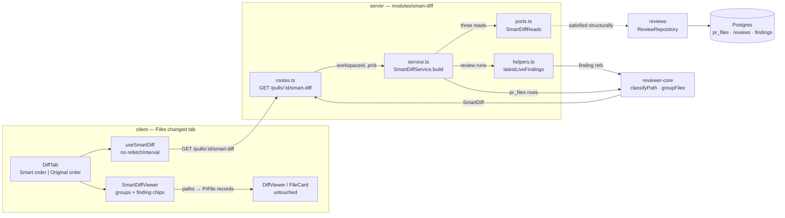

# Smart Diff — why the risk ordering is a pure classifier, not a model call

Smart Diff re-orders a PR's changed files into three groups — `core`, `wiring`,
`boilerplate` — so a reviewer meets the service that changed before `pnpm-lock.yaml`. It
adds `GET /pulls/:id/smart-diff` and returns the pre-existing `SmartDiff` contract
(`server/src/vendor/shared/contracts/brief.ts:105-113`). This page records the decisions
behind it. What the endpoint exposes belongs in [../README.md](../README.md); the ordering
rules themselves are documented at their definition in
`reviewer-core/src/constants.ts`.

## The shape of the flow

Three reads and one pure function. There is no LLM port on this path, no provider and no
review-engine entry point, which is what makes a page open free and the same PR render the
same order every time.

## Why the classifier lives in `reviewer-core` (O1)

Five placements were written up in `.devdigest/cache/options/smart-diff.md`; the human
picked **O1** against the brainstorm's own shortlist, which ranked O2 first. What O1 buys
is that the rule set is reachable from a CI export, an MCP tool or `run-executor.ts`
deciding which files reach the prompt — none of which can import from a server module. The
price is the widest file set of the five and a new server slice that has to be onion-clean
from day one, with no baselined edge to hide behind.

The four rejected placements, and the reason each lost:

| Option | Placement | Why not |
|---|---|---|
| O2 | a feature file in the `reviews` module, mirroring `intent.ts` | Cheapest and the exact L03 precedent, but it grows an already-large module and walls the rules behind `no-cross-module`. |
| O3 | client-only, no endpoint | Written to mark the cheap edge of the space. Leaves `SmartDiffResponse` unused and parks the rules in the one package CI and MCP cannot import. |
| O4 | a persisted `pr_files.role` column | Buys nothing at this scale — `GET /pulls/:id` re-imports the rows on every page load, so the cache is rewritten as often as it is read, and a pattern change needs a backfill. |
| O5 | repo-intel `file_rank` for ordering inside `core` | `getFileRank` returns `[]` when the repo is unindexed, so the order would change with index state. That contradicts "deterministic". It remains the only credible basis for real `split_suggestion` output. |

## The slice ships no `repository.ts`

O1's own write-up proposed `routes.ts → service.ts → repository.ts + ports.ts`. The
approved plan dropped the repository, and the shipped slice has none. `pr_files`,
`reviews` and `findings` are already owned by `ReviewRepository`, which declares itself the
only layer touching the DB for the review domain — a second repository over the same tables
would break onion rule C2. Instead `ports.ts` declares `SmartDiffReads`, three methods
wide, and the composition root passes `container.reviewRepo` in; it satisfies the port
**structurally**, so there is no adapter and no mapper to keep in sync.

The row shapes in `ports.ts` are restated rather than imported from `db/rows.ts` on purpose:
dependency-cruiser counts a type-only import as an edge, so a `helpers.ts` reaching `db/`
would fail `c5-pure-helpers`. The slice therefore has zero `db/` import edges.
`architecture-reviewer` ruled the arrangement compliant.

## What ships deliberately empty

The contract was not edited for this feature — both `vendor/shared/contracts/brief.ts`
copies stay byte-identical — so two of its fields ship unfilled:

- **`pseudocode_summary` is `null` for every file.** Writing one needs a paid model call,
  and Smart Diff is specified as a zero-call feature.
- **`split_suggestion` is contract-shaped only.** `too_big` comes from a line-count
  threshold (`SMART_DIFF_TOO_BIG_LINES`) and `total_lines` is real, but
  `proposed_splits` is always `[]`. Proposing actual splits needs the import graph and
  symbol owners that repo-intel holds and this path does not read — that is O5, unchosen.

Per-line severity colour is also absent from the contract, by the same reasoning:
`SmartDiffFile.finding_lines` is `number[]`, and editing the contract means editing two
already-diverged copies. The client re-derives the colour instead, in
`client/src/app/repos/[repoId]/pulls/[number]/_components/SmartDiffViewer/helpers.ts`,
by importing `latestRunPerAgent` and `isLiveFinding` from `@/lib/severity` — importing
them rather than restating them is what keeps a chip's colour equal to the header chip that
counted it.

## The "last review" formula now exists in three places

> **Changing the "last review" rule means changing three files, not one.**
> `client/src/lib/severity.ts` (`latestRunPerAgent` + `isLiveFinding`),
> `server/src/modules/pulls/status.ts` (`rollupSeverities`) and
> `server/src/modules/smart-diff/helpers.ts` (`latestLiveFindings`) each state it
> independently. `no-cross-module` forbids this slice from importing `../pulls/status.js`,
> so a shared helper is not available. Miss one and the Smart Diff badge counts drift
> silently from the PR-detail header chips.

The formula: newest review per `agent_id`, a null `agent_id` gets its own bucket (an ad-hoc
run is not "the same agent" as another ad-hoc run), dismissed findings excluded. Accepted
findings still count — they are real, just already handled.

`latestLiveFindings` sorts by `createdAt` descending itself rather than trusting the
repository's `ORDER BY`, with the review id as a tiebreak so the order is total. The client
copy relies on the API being newest-first, and that coupling is exactly what lets the two
definitions diverge unnoticed.

## Why the client renders no diff rows

Reordering and grouping *is* the feature, so `SmartDiffViewer` maps each group's paths back
onto the real `PrFile` records and hands them to the existing `DiffViewer`; nothing under
`client/src/components/diff-viewer/` was touched. Two consequences worth knowing:

- **The order lives in the URL, not component state.** `?order=original` is the explicit
  opt-out and smart is the default, so a shared link preserves the order the sender saw.
- **A collapsed group has to expand before a deep link can land.** `FileCard` renders
  `{open && …}`, so a target line is absent from the DOM while its group is closed, and
  `boilerplate` starts collapsed. `SmartDiffViewer` runs an effect that only *expands*; the
  scroll belongs to the target line's own mount effect, which runs after the expansion has
  painted. Expanding and scrolling cannot happen in one effect.
- **Smart Diff can never hide the diff.** Loading, an error, or an empty group set all fall
  back to the previous plain rendering, and the toggle's smart button disables itself.

## What was measured

All four lanes green: `reviewer-core` 54 tests, server unit 213, server integration 74
(Docker), client 174. `corepack pnpm arch` clean, with
`.dependency-cruiser-known-violations.json` unchanged at 27. `architecture-reviewer` found
no onion violations; `security-reviewer` found no exploitable findings. `plan-verifier`
scored 96 items — 93 met, 2 partial, 0 missing, 1 unverifiable — and the unverifiable one
was closed afterwards by a `DiffTab.test.tsx` that runs the inline-comment flow in both
orders.

The workspace-scoped `getPull` call happens **first** in `SmartDiffService.build`. That is
the authorization boundary: a PR in another workspace must 404 there rather than leak its
file paths.

## A stale invariant found on the way

`.claude/skills/pr-self-review/invariants.md:36` raises a `ci-filter-gap` WARNING claiming
`.github/workflows/server-integration.yml` has no `reviewer-core/**` path filter. **The
claim is false.** The filter is present under both `push.paths`
(`.github/workflows/server-integration.yml:24`) and `pull_request.paths` (`:29`), and a
header comment at `:12-16` explains why it is there. Two agents verified this
independently. Neither the invariant nor the workflow was edited as part of this change —
this note exists so the observation is not lost with the transcript.
